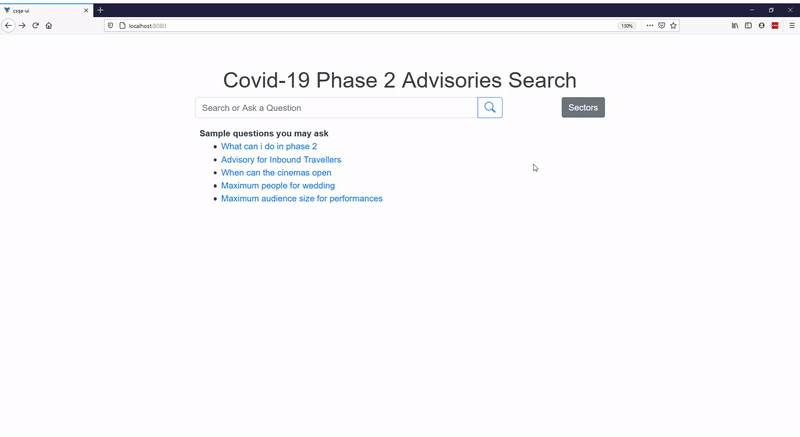

# covid19-search-and-qa
[Covid-19 Phase 2 Sector Advisories](https://www.moh.gov.sg/covid-19/phase-2-sector-related-advisories) Search and Question Answering with Transformers. 

A mini project to try out document question answering with transformers using [Haystack](https://github.com/deepset-ai/haystack) and [FastAPI](https://github.com/tiangolo/fastapi).

## Why am I doing this?
[Huggingface transformers](https://github.com/huggingface/transformers) have massively disrupted the NLP field in recent times as it provides an intuitive interface to access the almighty transformer models. Therefore, embarking on this mini project was one of the best opportunities to apply it to a real world use case and create positive value at the same time. Another objective of this project was also to get my hands dirty with a relatively new, modern web framework for building APIs, [FastAPI](https://github.com/tiangolo/fastapi), that have also been making waves due to it's performance and intuitive design.

## Show me what it does!
1. Search and Question Answering

2. Search and Question Answering Filtered by Sector

## What's so good about this?
In the current state of the new normal, [official announcements and advisories](https://www.moh.gov.sg/covid-19/phase-2-sector-related-advisories) provide guidelines for how we can resume our daily activities safely. However, there is simply too many documents covering various aspects of our daily lives and businesses. FAQ documents may help to highlight key points but it is often time consuming to create and may not have a comprehensive coverage.

With [Haystack](https://github.com/deepset-ai/haystack), we are able to use [pretrained transformer models](https://huggingface.co/deepset/roberta-base-squad2) to read the content of the advisories and provide relevant answers to user queries, **directly retrieving relevant answers from the documents** itself instead of relying on manually curated FAQs.

## What's in this project?
There are 3 components in this project.
1. `crawl.py` - Script to crawl, process and ingest the documents from [Covid-19 Phase 2 Sector-Related Advisories](https://www.moh.gov.sg/covid-19/phase-2-sector-related-advisories) to Elasticsearch.
2. `csqa-api` - A [FastAPI](https://github.com/tiangolo/fastapi) app that provides the search and question answering APIs.
3. `csqa-ui` - A [Vue.js](https://vuejs.org/) app that provides UI for search and question answering.

## How to run it?

### 1. Setup Python Environment
- Install gcc `sudo apt-get install gcc python3-dev`. Required due to psutil.
- Create an environment for the project. `conda create -n csqa python=3.7`
- Run `conda activate csqa`
- Install libraries `pip install -r requirements.txt`

### 2. Get Apache Tika 
- Download Apache Tika Server from [here](https://www.apache.org/dyn/closer.cgi/tika/tika-server-1.24.1.jar)
- Ensure you have java 8 installed before running.

### 3. Build Your UI
- Install node modules `yarn install`
- Build for deployment `yarn build`

### 4. Run Everything!
1. Start Elasticsearch (with docker).
    
    a. Without pre-crawled data
    - Run `docker run -p 9200:9200 -e "discovery.type=single-node" docker.elastic.co/elasticsearch/elasticsearch:7.6.2`
        
    b. With pre-crawled data You may use the pre-crawled index by running with volume. 
    - Download Elasticsearch index with pre-crawled data [here](https://drive.google.com/file/d/12FDd09Ehg_6fVwG2TD-qAqxVrrPe-Avr/view?usp=sharing) (last updated 9th Sep 2020).
    - Run `docker run -p 9200:9200 -e "discovery.type=single-node" -v <path to downloaded data folder>:/usr/share/elasticsearch/data docker.elastic.co/elasticsearch/elasticsearch:7.6.2`

3. Run tika (if you are running `crawl.py`)

    a. Run `java -jar tika-server-1.24.1.jar`

2. Run crawler (if you are not using the pre-crawled index)

    a. Run `python crawl.py`

3. Start the FastAPI app

    a. Run `python app.py`

4. Start your UI

    a. Run `dist` folder in the web server of choice. (E.g. nginx, serve, apache http etc)
